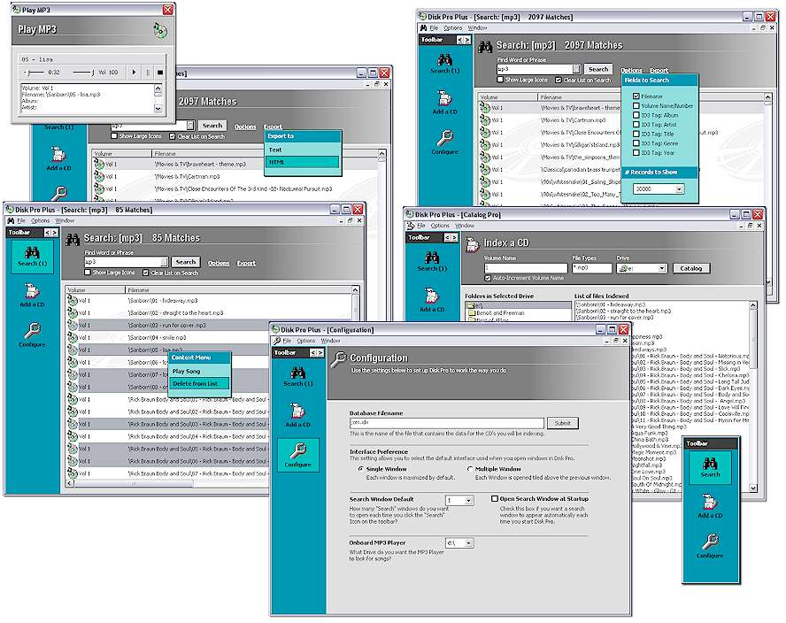



## MP3 CD Indexer and Player

### Description

This is an update to a previous submission, with many more features (thanks to your feedback). here goes: Disk Pro is an MP3 Indexing program. If you have lots of CD's that contain MP3 files, and you need a quick way to see what CD has what song, this program is a great start! It allows you to rapidly index CD's (insert one by one), storing all file and volume information, ID tag info, and misc info like bit rate, length, etc, into a data file. You can then easily perform searches on one or more fields to locate the song(s) at a later time. Also, you can build custom lists by performing multiple searches, then manually adding/deleting entires. I also added some extra GUI features, such as: Time intensive tasks all use a progress bar with a Cancel function, inclusion of a translucent, detachable, dockable toolbar, html template reports (for easy modification), sortable listview with sizable columns that remember their size next time you do a search, interface configuration page, and 99% persistent interface (it remembers everything so next time you start app, it will be the way you left it). Keywords used for searches are also maintained. The Export-To-HTML uses template files, so you can easily modify the files to format the HTML output the way you choose. Also, you can PLAY the MP3 files right from within Disk Pro (simply right-click on a song and select PLAY. Disk Pro will prompt you for the CD). This is an update to last months post, with many added functions, and alot of bug fixes and interface enhancements. It should be a good start for a great indexing program.
 
### More Info
 

             |
---                |---
**Submitted On**   |2002-09-02 15:38:12
**By**             |[Anthony Awx](https://github.com/Planet-Source-Code/PSCIndex/blob/master/ByAuthor/anthony-awx.md)
**Level**          |Advanced
**User Rating**    |5.0 (30 globes from 6 users)
**Compatibility**  |VB 6\.0
**Category**       |[Sound/MP3](https://github.com/Planet-Source-Code/PSCIndex/blob/master/ByCategory/sound-mp3__1-45.md)
**World**          |[Visual Basic](https://github.com/Planet-Source-Code/PSCIndex/blob/master/ByWorld/visual-basic.md)
**Archive File**   |[MP3\_CD\_Ind125702922002\.zip](https://github.com/Planet-Source-Code/anthony-awx-mp3-cd-indexer-and-player__1-38596/archive/master.zip)

